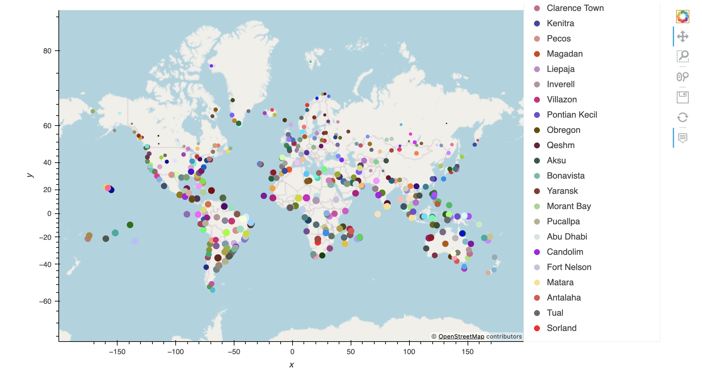
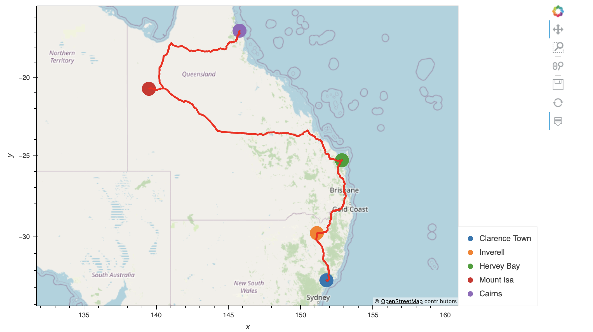

# World_Weather_Analysis

## Overview

The PlanMyTrip app is a great app for traveling, however, changes have been suggested to take it to the next level. Specifically, the weather description so users know what type of weather to expect at their destination. Using weather description data, beta testers input their weather preferences and travel destinations and nearby hotels were filtered accordingly. Then, four cities were chosen from the list of candidate cities and a travel route was created as well as a marker layer map for the beta testers. 

### Map Previews

